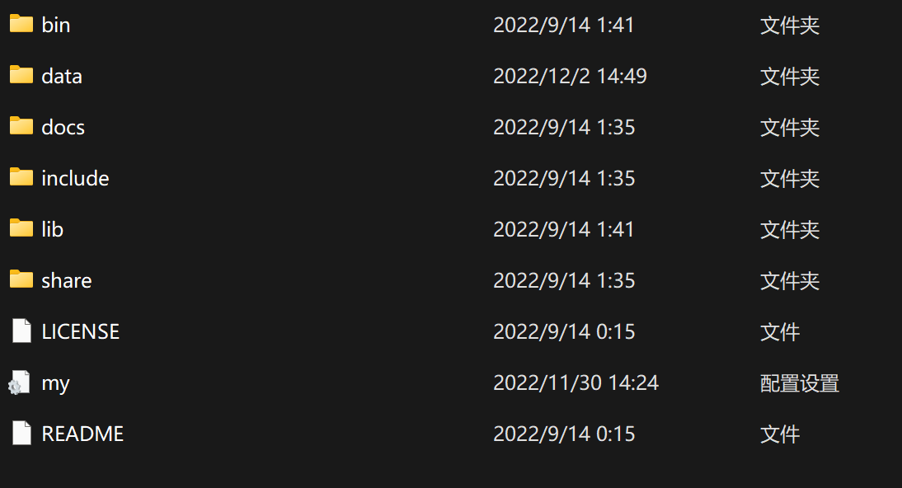

# Python程序设计大作业
王锦鹏 未央-水木12 2021012595
>本项目后端部分采用PyCharm进行开发。
>数据库使用MySQL。

## 项目特色
* 在存储用户的密码时使用`werkzeug.security`下的哈希加密算法进行加密，一定程度上保证数据安全
* 将项目部署在网页，采用python的flask框架进行开发。
## 配置信息
### 配置数据库
本次大作业采用MySQL数据库。配置步骤如下:（配置步骤来自CSDN）
* 前往[官网](https://dev.mysql.com/downloads/)下载MySQL Community Server版本并解压

* 得到如上目录(除`my.ini`)。下面在文件夹里新建一个名为`my.ini`的配置文件，写入并执行：**（注意要自行填写目录）**
```ini
[mysqld]
# 设置3306端口
port=3306
# todo:在下面填写解压后的根目录
basedir=
# 设置mysql数据库的数据的存放目录  ---------是你的文件路径data文件夹自行创建
#datadir=E:\mysql\mysql\data
# 允许最大连接数
max_connections=200
# 允许连接失败的次数。
max_connect_errors=10
# 服务端使用的字符集默认为utf8mb4
character-set-server=utf8mb4
# 创建新表时将使用的默认存储引擎
default-storage-engine=INNODB
# 默认使用“mysql_native_password”插件认证
#mysql_native_password
default_authentication_plugin=mysql_native_password
[mysql]
# 设置mysql客户端默认字符集
default-character-set=utf8mb4
[client]
# 设置mysql客户端连接服务端时默认使用的端口
port=3306
default-character-set=utf8mb4
```
* 初始化MySQL数据库 以管理员身份打开命令提示符 切换到bin目录下，执行
* `mysqld --initialize --console`
* 记录下随机生成的初始密码
* 安装SQL:`mysqld --install mysql`
* 启动SQL:`net start mysql`
* 在`mysql -u root -p`后输入系统生成的随机密码
* 修改密码为111111:`ALTER USER 'root'@'localhost' IDENTIFIED BY '111111';`
* 然后配置环境变量，然后在系统变量里面找到path变量，添加`%MYSQL_HOME%\bin`。
* 至此MySQL配置完成。（在开发过程中我使用的是JetBrains的DataGrip软件。）
* 然后创建本次大作业在本地存储的数据库。步骤如下：
* 管理员cmd输入`mysql -u root -p`,随后输入密码`111111`;
* 输入`create schema wjp;`
* 数据库创建完成。
### 配置conda环境
* 如果计算机未安装anaconda,从[官网](https://www.anaconda.com/)下载。以下假定conda已安装完成
* 管理员模式打开cmd,输入`conda create -n flask`创建一个名为flask的虚拟环境
* 创建完成后,控制台输入`conda activate flask`
* 安装本次大作业必须的库：
```cmd
pip install flask
pip install flask_migrate
pip install flask_sqlalchemy
pip install wtforms
pip install flask_socketio
pip install flask_wtf
pip install pymysql
pip install flask_login
```
**一定要先激活conda环境!**
至此，conda环境配置完成。

### 利用flask对数据库进行操作
* 首先进入项目所在的文件夹,运行cmd
* 激活虚拟环境:`conda activate flask`
* 输入指令`flask db init`（此指令只需输入一次）
* 随后会自动在目录中生成migrations文件夹
* 输入指令`flask db migrate`和`flask db upgrade`,可以将更改同步到数据库中。

## 项目运行
直接运行文件`app.py`即可。（如果想实现多人同时聊天，同时运行`run_2.py`。具体步骤report中有详细叙述)