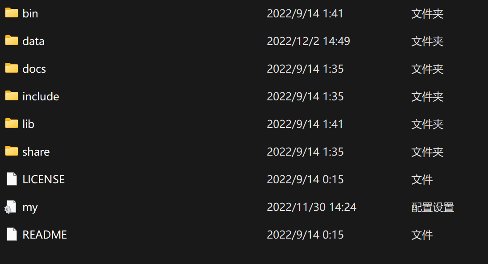
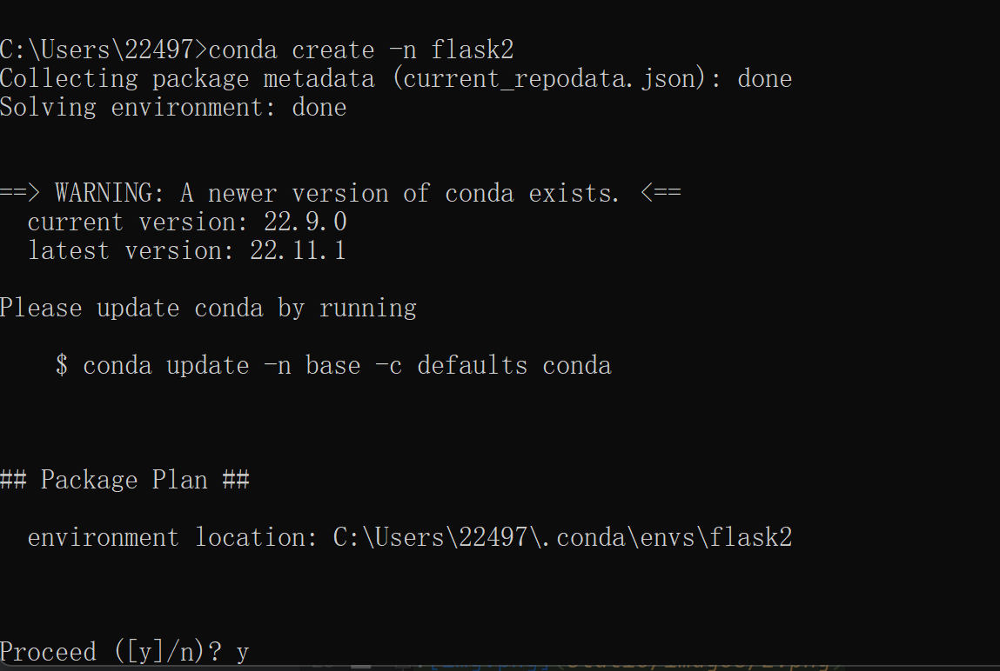
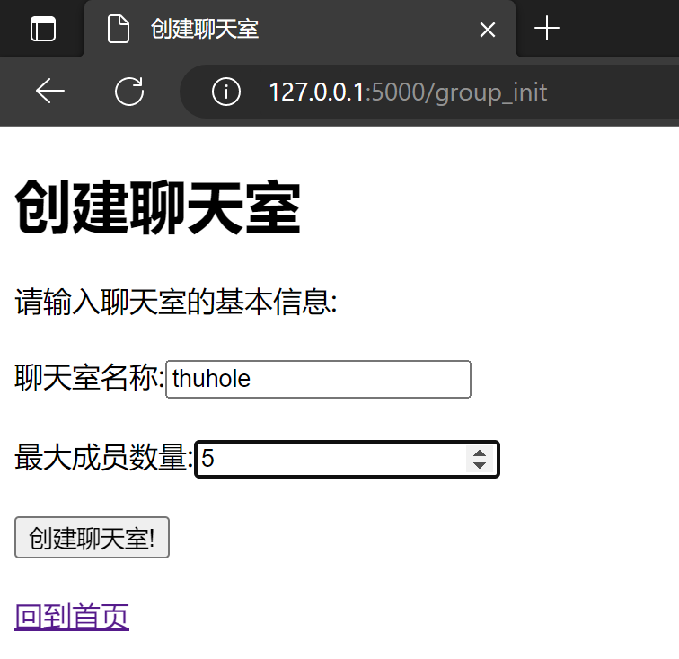

# Python大作业实验报告
王锦鹏 未央-水木12 2021012595

## 聊天室功能
本聊天室采用flask框架，基本实现了一个简易的在本地搭建的web聊天室。
我们实现了如下功能:

* 大作业要求中的所有基本功能(将在后面进行演示)

  提高功能中的:

* 实现图形化界面

* 存储信息

* 查看聊天记录
具体地:用户可以注册账户、登录账号然后进入聊天室、聊天（无论是私聊还是群聊）、登出。还可以添加你喜欢的好友、创建属于自己的聊天室并设置人数上限。登录失败、聊天室满员、进入进出聊天室和私聊、登入登出均会有消息框提醒。
还可以在聊天室和私聊界面查看聊天记录。聊天记录可以手动保存在本地的`log.txt`文件中（在首页点击保存聊天记录到本地），同时数据库端会实时保存所有用户的账户名、密码（经过哈希加密后储存）、昵称、群聊和私聊的聊天记录、聊天室信息、好友关系信息等等。
功能丰富多样。

## 架构描述和设计描述

文件架构:


## 整体操作步骤演示
* 下面是`readme.md`中的配置步骤：
### 配置数据库
本次大作业采用MySQL数据库。配置步骤如下:（配置步骤来自CSDN）
* 前往[官网](https://dev.mysql.com/downloads/)下载MySQL Community Server版本并解压

* 得到如上目录(除`my.ini`)。下面在文件夹里新建一个名为`my.ini`的配置文件，写入并执行：**（注意要自行填写目录）**
```ini
[mysqld]
# 设置3306端口
port=3306
# todo:在下面填写解压后的根目录
basedir=
# 设置mysql数据库的数据的存放目录  ---------是你的文件路径data文件夹自行创建
#datadir=E:\mysql\mysql\data
# 允许最大连接数
max_connections=200
# 允许连接失败的次数。
max_connect_errors=10
# 服务端使用的字符集默认为utf8mb4
character-set-server=utf8mb4
# 创建新表时将使用的默认存储引擎
default-storage-engine=INNODB
# 默认使用“mysql_native_password”插件认证
#mysql_native_password
default_authentication_plugin=mysql_native_password
[mysql]
# 设置mysql客户端默认字符集
default-character-set=utf8mb4
[client]
# 设置mysql客户端连接服务端时默认使用的端口
port=3306
default-character-set=utf8mb4
```
* 初始化MySQL数据库 以管理员身份打开命令提示符 切换到bin目录下，执行
* `mysqld --initialize --console`
* 记录下随机生成的初始密码
* 安装SQL:`mysqld --install mysql`
* 启动SQL:`net start mysql`
* 在`mysql -u root -p`后输入系统生成的随机密码
* 修改密码为111111:`ALTER USER 'root'@'localhost' IDENTIFIED BY '111111';`
* 然后配置环境变量，然后在系统变量里面找到path变量，添加`%MYSQL_HOME%\bin`。
* 至此MySQL配置完成。（在开发过程中我使用的是JetBrains的DataGrip软件。）
* 然后创建本次大作业在本地存储的数据库。步骤如下：
* 管理员cmd输入`mysql -u root -p`,随后输入密码`111111`;
* 输入`create schema wjp;`(该名称不可更改，因为项目中调用的数据库名称是wjp)
* 数据库创建完成。
### 配置conda环境
* 如果计算机未安装anaconda,从[官网](https://www.anaconda.com/)下载。以下假定conda已安装完成
* 管理员模式打开cmd,输入`conda create -n flask`创建一个名为flask的虚拟环境
* 创建完成后,控制台输入`conda activate flask`
* 安装本次大作业必须的库：
```cmd
pip install flask
pip install flask_migrate
pip install flask_sqlalchemy
pip install wtforms
pip install flask_socketio
pip install flask_wtf
pip install pymysql
pip install flask_login
```
**一定要先激活conda环境!**
至此，conda环境配置完成。

### 利用flask对数据库进行操作
* 首先进入项目所在的文件夹,运行cmd
* 确认数据库已经激活。我们可以通过管理员运行cmd,输入`mysql -u root -p`,然后输入密码(之前设置的是111111)。
* 如果成功进入则表明已激活。否则，在windows环境下右键计算机->管理->服务和应用程序,找到mysql并激活(MacOS环境类似找到mysql服务激活。)
* 激活虚拟环境:`conda activate flask`
* 输入指令`flask db init`（此指令只需输入一次）
* 随后会自动在目录中生成migrations文件夹
* 输入指令`flask db migrate`和`flask db upgrade`,可以将更改同步到数据库中。
### 下面是操作过程演示
* 如果计算机上还没有安装anaconda和MySQL,按照上面的安装步骤安装。
* 打开cmd,使用conda新建一个环境。在`readme.md`中指定的环境名是flask。
我们这里另外指定一个环境名用于测试:`conda create -n flask2`(名字任取即可，并不本质)
>在这里发现某些代理工具可能会影响conda下载包。如果遇到错误可以尝试关闭网络代理工具后重试。
* 
* 然后激活环境，安装项目所需要的各种包（前面已有叙述。）
* 运行文件`app.py`。
* 在项目文件夹的根目录下按`readme.md`中的步骤初始化数据库:（注意要先按照前文中步骤创建好数据库'wjp'）
```
flask db init
flask db migrate
flask db upgrade
```

* 发现文件目录中多了`migrations`文件夹。
* 数据库中也创建完成了相关表。


* 下面注册新用户。
* 在浏览器中输入127.0.0.1:5000，进入首页
* 
* 点击登录后点击注册:
* 输入用户名Alice,密码111111:
* 
注意一定要符合用户名和密码的长度要求（强度无限制），以及两次输入的密码要一致。
* 注册完成后回到主界面登录。（这里数据库中已经存储了Alice的用户信息。）
* 
* 进入首页如图。
* 
* 由于我们还没有创建聊天室和添加好友，故上述列表为空。先创建一个聊天室：
* 点击`创建聊天室`
* 在这里我们可以输入聊天室的名称和最大成员数量，例如:
* 
* 点击创建聊天室，自动跳转回首页。
* 
* 由于还没有人加入聊天室，故当前成员数量为0
* 为了方便后面的演示，我们再注册三个用户Bob、Carol、Dave,密码均为111111。
* 注册完成后，登录Alice账号，把这三个用户均添加为好友。具体地，在首页中点击`添加好友`
* 在框中依次输入Bob,Carol,Dave并点击添加好友
* 
* 回到首页：
* 
* 好友列表中出现了Bob,Carol,Dave。
* 登出功能实现：在首页中点击“登出”，弹出提示框
* 
* 随后回到登录界面。
* 下面我们开始实现聊天。
* 点击`进入聊天室`
* 
* 输入你想使用的昵称和聊天室编号（在本次大作业中我们可以在任意聊天室中实现任意使用昵称，\
发言也会以昵称形式，但后台数据库记录的发言数据既有昵称也有真实身份。）
* 如果聊天室不存在或者聊天室人数已满，会弹出不同的提示窗口提示：
* 
* 
* 用户可以自由进出聊天室。如果之前没有进入过，则会自动为该用户注册该聊天室的账号。
* 进入聊天室，有消息提醒：
* 
* 退出聊天室，有消息提醒：
* 
* 在Bob也注册到聊天室`thuhole`后，可以看到聊天室的成员。
* 既有Alice也有Bob:
* 
* 下面实现多人实时聊天。
* 在运行app.py的基础上运行`run_2.py`。`run_2.py`除了端口号为5001，域名为127.0.1.3外其余均与
`app.py`一致。这样可以实现两人同时聊天，只需要两个人在浏览器中使用不同的端口号和域名,\
即127.0.0.1:5000和127.0.1.3:5001即可。
* 类似的，可以通过创建文件`run_3.py`,...实现多人同时聊天，只需要修改端口号和域名即可。
* 下面以Alice和Bob为例简单演示下多人聊天：
* 新创建一个聊天室`test_chat`,然后让Alice和Bob加入。

* 
* 可以实现Alice发送消息后Bob端也能够接收到（注意聊天框仅当点击刷新键或者发送完一段消息后才会刷新内容。）
* 
* 我们还可以尝试下让Carol加入群聊:由于一开始设置的聊天室上限为2人，故加入失败
* 
* 下面演示私聊。例如：Alice和Bob
* 私聊的前提是加好友，所以先点击`添加好友`添加，如果已经是好友则继续：
* 以Alice登录，在首页点击`单人聊天`，然后输入你想使用的昵称和你想要聊天的对象的用户名Bob
* 
* 进入和离开私聊均有提示。
* 下面演示保存聊天记录到本地文件：
* 登陆后在首页点击`保存聊天记录到本地`
* 
* 然后可以打开本地的log.txt文件查看：
* 
## 下面演示提高功能。
### 实现图形化界面
* 登录界面如下

这里包括了账号、密码。由于本次大作业的昵称设置在进入群聊这一步骤前，故在登录界面没有昵称这一栏。
登录失败的消息框提示：
有三种登录失败类型，分别为:格式不合规、用户名不存在、用户名存在但密码输入错误。


注：在数据库中的密码并非是明文存储，而是采用哈希加密。这也体现了保护用户数据安全的理念。
* 聊天室界面

有聊天室名称、聊天室成员数量、最大成员数量
好友列表包括好友的基本信息即账号。同样地，由于好友每次进入聊天室使用的昵称均可以任意指定，故没有存储好友的昵称。
* 进入聊天室和私聊界面
* 
* 
* 可以选择一个聊天室或者选择一个好友私聊
* 在聊天室中，可以查看成员信息，聊天信息以昵称的形式标明发送者（后台不仅存储昵称也存储账户）：
* 
* 离开聊天室有消息框提醒：
* 
* 离开私聊有消息框提醒：
* 
* 登出账号有消息框提醒：
* 
### 存储信息
在`SQLdata.py`中存储了数据库中表的设计:
```python
from datetime import datetime
from extensions import db
from flask_login import UserMixin


class RegisteredUser(db.Model):
    __tablename__ = 'user'
    id = db.Column(db.Integer, autoincrement=True, primary_key=True)
    username = db.Column(db.String(100), nullable=False)
    password = db.Column(db.String(1000), nullable=False)
    register_time = db.Column(db.DateTime, default=datetime.now)


class ChatLog(db.Model):
    __tablename__ = 'chatlog'
    id = db.Column(db.Integer, autoincrement=True, primary_key=True)
    # send_by_user_id = db.Column(db.String(100), db.ForeignKey("user.id"), nullable=False)# 外键
    send_by_user_id = db.Column(db.String(100), nullable=False)
    send_by_nickname = db.Column(db.String(100), nullable=False)
    text = db.Column(db.Text, nullable=False)
    send_time = db.Column(db.DateTime, default=datetime.now)
    send_by_chatroom = db.Column(db.String(100), nullable=False)


class ChatRoomList(db.Model):
    __tablename__ = 'chatroom'
    id = db.Column(db.Integer, autoincrement=True, primary_key=True)
    roomname = db.Column(db.String(100), nullable=False)
    max_users = db.Column(db.Integer, nullable=False)


class PersonalChatLog(db.Model):
    __tablename__ = 'personalchatlog'
    id = db.Column(db.Integer, autoincrement=True, primary_key=True)
    # send_by_user_id = db.Column(db.Integer, db.ForeignKey("user.id"), nullable=False)  # 外键
    send_by_user_id = db.Column(db.String(100), nullable=False)
    receiver=db.Column(db.String(100), nullable=False)
    text = db.Column(db.Text, nullable=False)
    send_time = db.Column(db.DateTime, default=datetime.now)


class FriendRelationship(db.Model):
    __tablename__ = 'friendrelationship'
    id = db.Column(db.Integer, autoincrement=True, primary_key=True)
    friend1 = db.Column(db.String(100), nullable=False)
    friend2 = db.Column(db.String(100), nullable=False)


class Room_User(db.Model):
    __tablename__ = 'room-user'
    id = db.Column(db.Integer, autoincrement=True, primary_key=True)
    user=db.Column(db.String(100), nullable=False)
    room=db.Column(db.String(100), nullable=False)

```
我们创建了账户信息表(RegisteredUser)、群聊聊天记录表(ChatLog)、聊天室表\
(ChatRoomList)、私聊聊天记录表(PersonalChatLog)、好友关系表(FriendRelationship)\
、聊天室——用户关系表(Room_User)。在数据库中也均有存储，举例如下：


也通过flask_sqlalchemy实现了用python连接数据库并调用数据库中的数据。
### 查看聊天记录
在聊天室和私聊界面中，均可以看到之前的所有聊天记录，且聊天记录有注明时间和发送者：

## 代码部分
整个项目的架构如图所示:

* 其中,在最终提交版本中`migration`文件夹不存在。其会在利用`flask db init`指令创建数据库时被自动初始化
（指令的详细步骤前面已有介绍）
* `static`文件夹用来存储图片(images)、html网页的一些css和js文件
* `templates`文件夹用来存储html文件。
* `app.py`为项目的主程序入口,需要运行app.py才能运行整个项目。
* `config.py`存储了SQL数据库的配置信息和SECRET_KEY.
* `extensions.py`初始化了"db"这一对象。
* `forms.py`存储了html网页所需要提交的一些表单信息。
* `SQLdata.py`存储了用来初始化SQL数据库的信息。
* `run_2.py`用来演示多人实时聊天，除ip和端口号与`app.py`不一样外其余均一致。
* 在`app.py`中，我们使用`@app.route`装饰器实现管理不同域名下的信息,
用`return render_template()`方法实现返回对应的html文档。
通过不同的域名管理实现了相应的功能。
* 关于存储用户的登录状态:我们用flask的全局变量`g`和浏览器cookie两种方式同步实现。
用户登录会创建cookie,用户登出会清除cookie。用户的密码是以哈希加密sha256的方式存储。

## 一些注意事项
* 由于使用pycharm的flask开发功能进行开发,故如果评测用平台也是pycharm，
  在运行`app.py`和`run_2.py`时可能会按照pycharm的预置配置，而不是py文件中的设置。
  可以使用vscode进行评测
* 安装包要在conda环境下

* 关于`提交完整性`这一部分:我们遵循了flask项目文件的惯用文件架构，故没有使用作业说明中要求的文件架构。